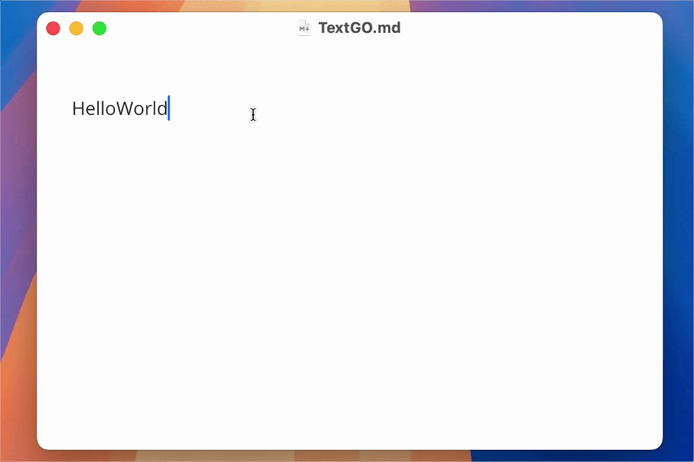
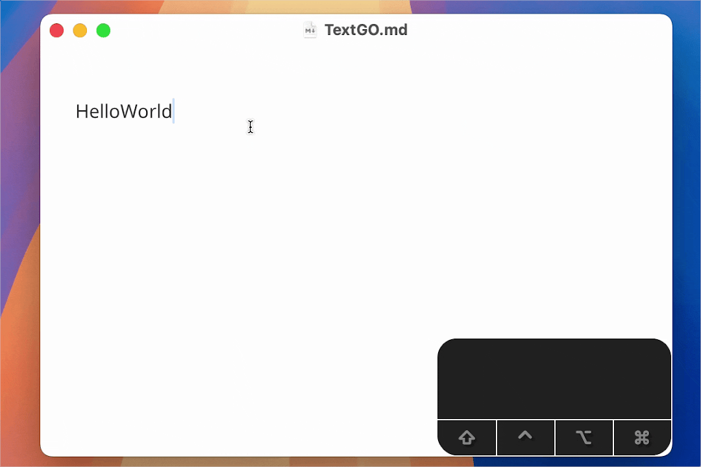
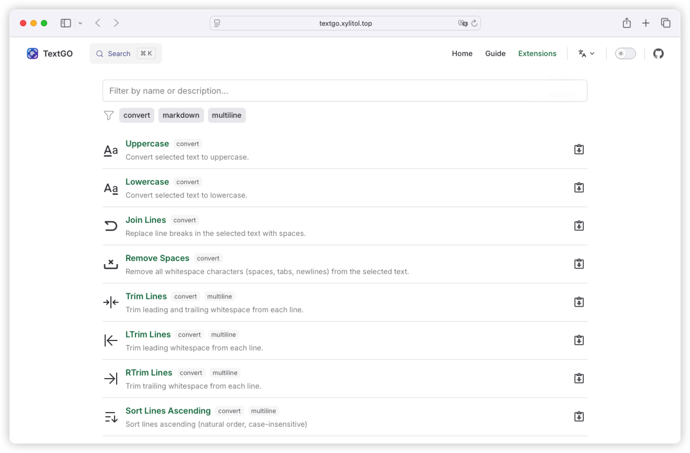
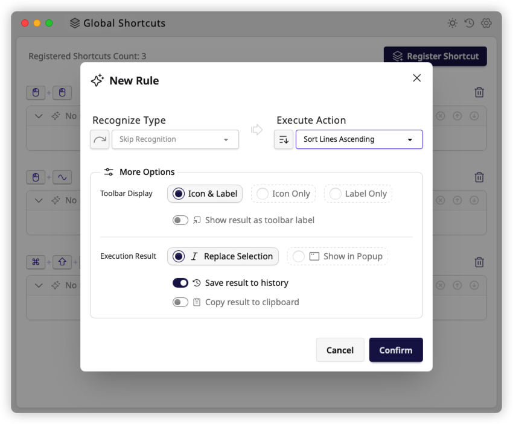
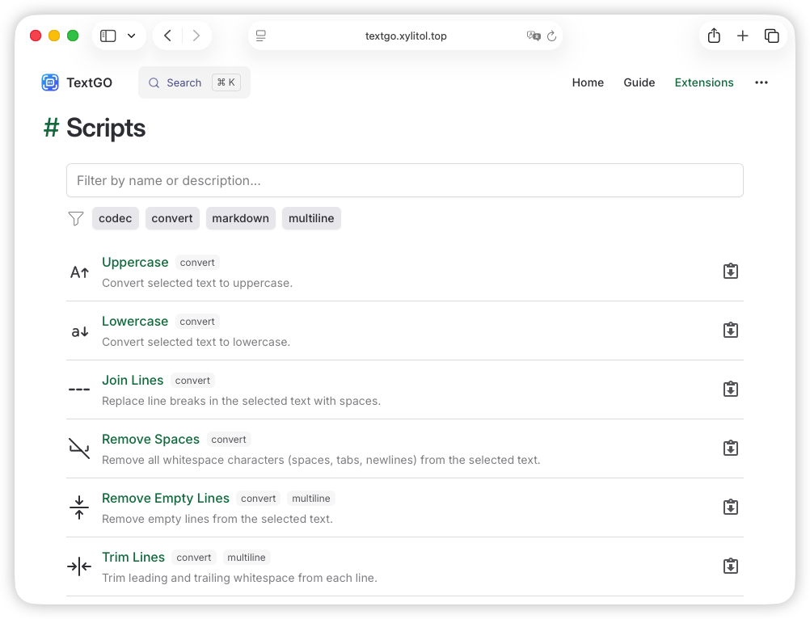
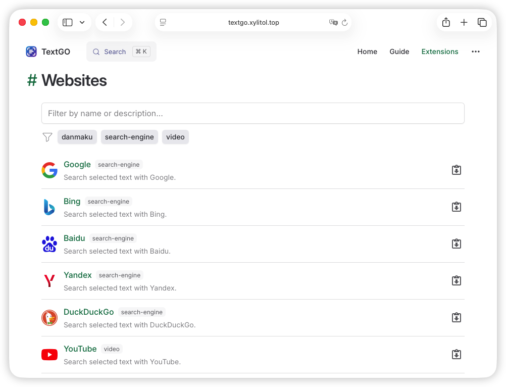

<div align="center">


[](https://github.com/C5H12O5/TextGO/releases)
[](https://github.com/C5H12O5/TextGO/stargazers)
[](LICENSE)
[](https://tauri.app/)
[](https://svelte.dev/)


📖 English / [简体中文](README.zh-CN.md)

_TextGO is a cross-platform text processing tool that recognizes text types and executes custom actions._

</div>

|  |  |
| ----------------------------------------------- | ----------------------------------------------- |

## ✨ Core Features

- **Multiple Triggers**: Hotkeys, double-click, or text selection, each with independent rule configurations.
- **Flexible Modes**: Choose instant execution or interactive toolbar mode based on your workflow.
- **Customizable Icons**: Upload custom SVG icons to create your personalized toolbar style.
- **Ready to Use**: Built-in rich text types and processing actions, simple configuration for immediate use.
- **Highly Extensible**: Extend with regex, ML models, scripts, or local AI for custom recognition and processing.

|  |  |
| ----------------------------------------------- | ----------------------------------------------- |

## ⬇️ Getting Started

### Installation

Download the installer for your platform from [**GitHub Releases**](https://github.com/C5H12O5/TextGO/releases) and follow the installation instructions.

### Permissions

On macOS, the following permissions are required for proper functionality:

1. **Accessibility**: Required for simulating keyboard input
2. **Input Monitoring**: Required for listening to mouse events

The system will automatically prompt you to grant these permissions while using the app. You can also manually configure them in "System Settings" > "Privacy & Security".

### Extensions

Visit the [**Extensions**](https://textgo.xylitol.top/extensions.html) page on the official website to browse and install various extensions that enhance the app's functionality:

|  |  |
| ----------------------------------------------- | ----------------------------------------------- |

### FAQ

<details>
<summary>1. macOS shows "App is damaged and can't be opened."</summary>

<br>

_Run the following command in the terminal to resolve:_

```bash
sudo xattr -r -d com.apple.quarantine /Applications/TextGO.app
```

</details>

<details>
<summary>2. macOS shows "Apple can't check app for malicious software."</summary>

<br>

_Follow these steps to resolve:_

1. Open "System Settings" > "Privacy & Security"
2. Find the blocked application in the "Security" section
3. Click the "Open Anyway" button
4. Enter your login password and confirm

</details>

> [!TIP]
> For detailed usage instructions, please refer to the [User Guide](https://textgo.xylitol.top/guide/getting-started.html).

## 🛠️ Development

1. Refer to [Tauri official documentation](https://v2.tauri.app/start/prerequisites/) to install Rust and Node.js (use [pnpm](https://pnpm.io/) as the package manager)
2. Clone and setup:
   ```bash
   git clone https://github.com/C5H12O5/TextGO.git
   cd TextGO
   pnpm install
   ```
3. Run development mode:

   ```bash
   pnpm tauri dev

   # enable debug logs on Unix-like systems
   RUST_LOG=debug pnpm tauri dev

   # enable debug logs on Windows PowerShell
   $env:RUST_LOG="debug"; pnpm tauri dev
   ```

4. Build installer:
   ```bash
   pnpm tauri build
   ```

## 🎉 Acknowledgments

This project is built upon many excellent open source projects. We would like to express our sincere gratitude to all the developers and contributors of these projects.

For a complete list of third-party dependencies and their licenses, please see [LICENSES.md](LICENSES.md).

## 📄 License

This project is released under the [GPLv3](LICENSE) open source license.
