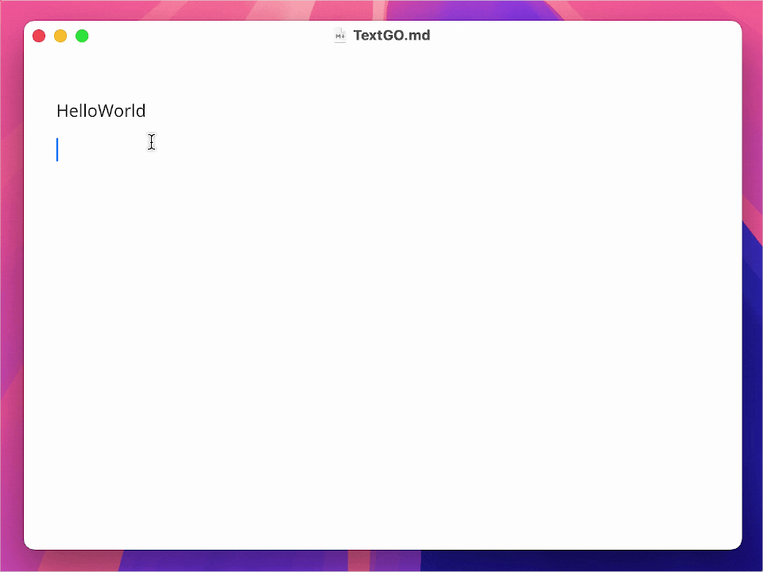
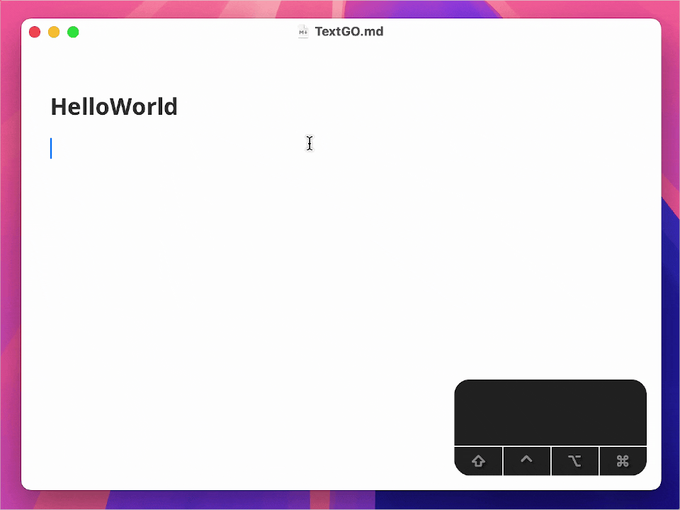
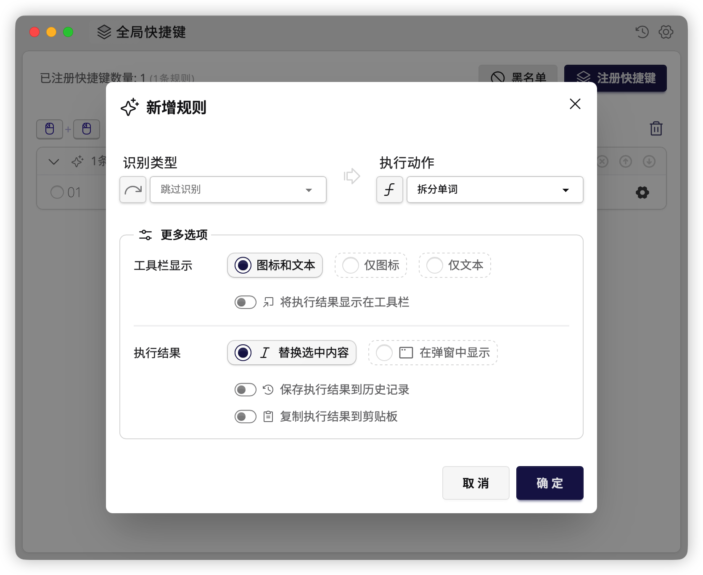
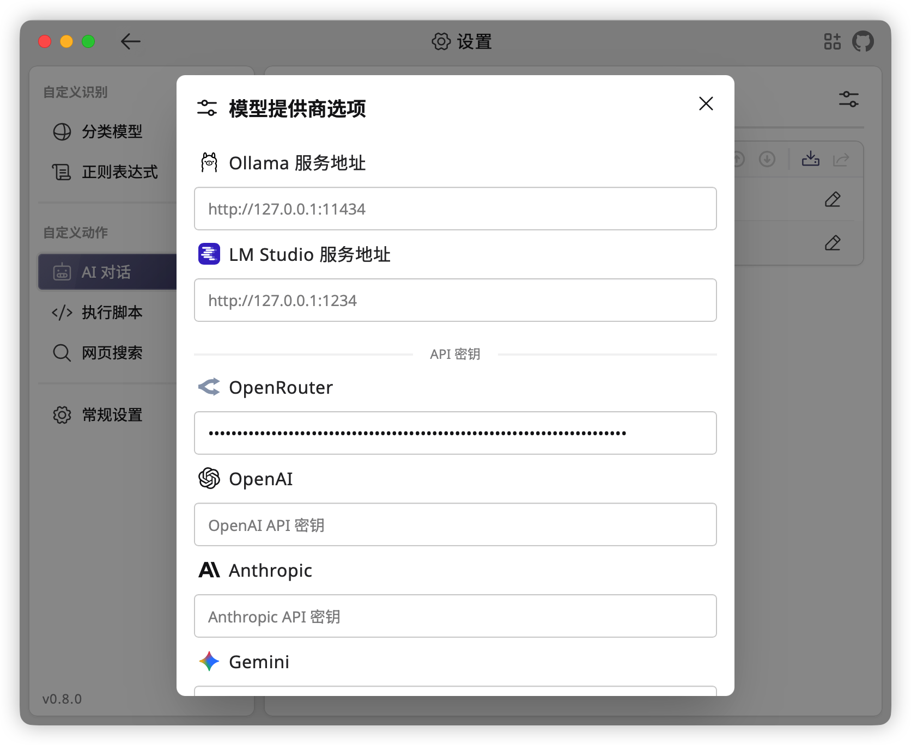
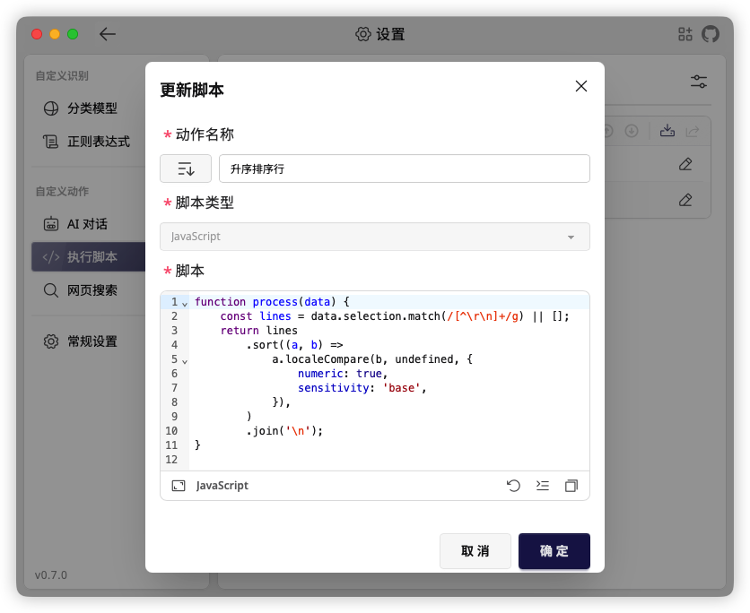
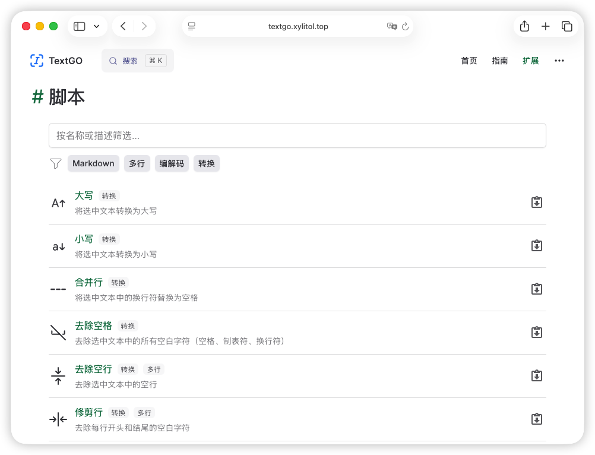
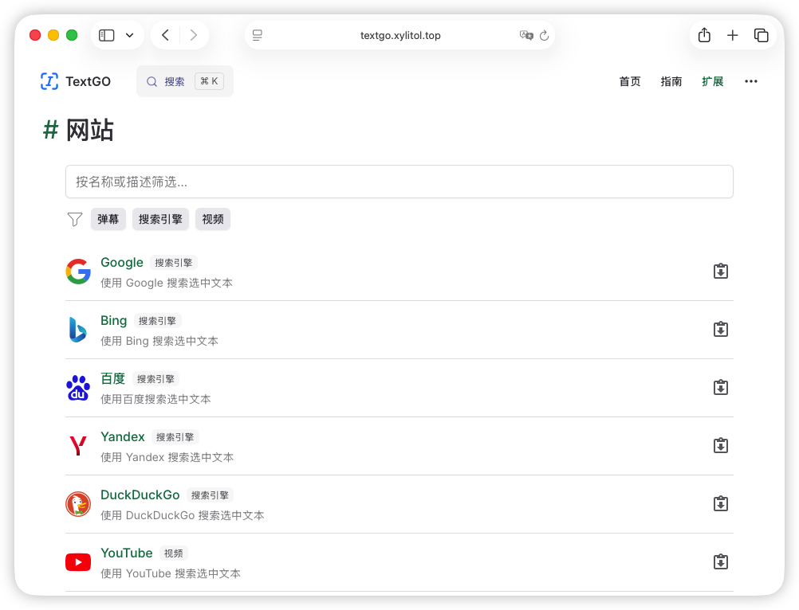

<div align="center">


<h1>TextGO</h1>

<p><strong>全能文本处理工具</strong></p>

[](https://github.com/C5H12O5/TextGO/releases)
[](https://github.com/C5H12O5/TextGO/stargazers)

[](LICENSE)
[](https://tauri.app/)
[](https://svelte.dev/)


📖 简体中文 / [English](README.md)

_TextGO 是一款跨平台文本处理工具，可识别文本类型并执行自定义动作。_

</div>

|  |  |
| --------------------------------------------------------------- | ------------------------------------------------------------- |

## ✨ 核心特性

- **快捷触发**：为键盘快捷键、鼠标双击、Shift+点击和拖拽选中分别配置规则
- **灵活模式**：可在立即执行和工具栏交互两种模式间切换
- **个性图标**：上传自定义 SVG 图标，打造个性化工具栏
- **开箱即用**：内置丰富的文本类型和处理动作，简单配置即可使用
- **自由扩展**：通过正则表达式、机器学习模型、脚本或本地/在线 AI 扩展能力

|  |  |  |
| ----------------------------------------------------------- | ------------------------------------------------------------------ | ---------------------------------------------------------------- |

## ⬇️ 使用说明

### 下载安装

从 [**GitHub Releases**](https://github.com/C5H12O5/TextGO/releases) 下载对应平台的安装包，并按照说明安装。

### 权限设置

TextGO 在 macOS 上需要开启“辅助功能”权限才能正常工作。

**设置步骤**：

1. 打开“系统设置”>“隐私与安全性”>“辅助功能”
2. 找到 TextGO 并勾选
3. 如未出现，点击“+”按钮手动添加 TextGO

> [!TIP]
> 应用首次使用时，系统会自动提示授权。

### 获取扩展

前往官方网站的[**扩展页面**](https://textgo.xylitol.top/zh-CN/extensions)，浏览并安装扩展：

|  |  |
| ---------------------------------------------------------- | ----------------------------------------------------------- |

### 常见问题

<details>
<summary>1. macOS 提示“App 已损坏，无法打开”。</summary>

<br>

_在终端运行以下命令：_

```bash
sudo xattr -r -d com.apple.quarantine /Applications/TextGO.app
```

</details>

<details>
<summary>2. macOS 提示“Apple 无法检查 App 是否包含恶意软件”。</summary>

<br>

_按以下步骤操作：_

1. 打开“系统设置”>“隐私与安全性”
2. 在“安全性”部分找到被阻止的应用
3. 点击“仍要打开”
4. 输入登录密码并确认

</details>

<details>
<summary>3. TextGO 更新后，macOS 辅助功能权限失效。</summary>

<br>

_TextGO 是未签名应用，macOS 会将辅助功能权限与当前二进制文件绑定。应用更新后，二进制文件的身份发生变化，原有权限随之失效，即使系统设置中仍显示为已启用。_

_重新授权：_

1. 打开“系统设置”>“隐私与安全性”>“辅助功能”
2. 选中 TextGO，点击“−”按钮将其移除
3. 点击“+”按钮重新添加 TextGO

</details>

> [!NOTE]
> 详细用法请参阅[用户指南](https://textgo.xylitol.top/zh-CN/guide/getting-started)。

## 🛠️ 开发指南

1. 按照 [Tauri 官方文档](https://v2.tauri.app/start/prerequisites/) 安装 Rust 和 Node.js，并使用 [pnpm](https://pnpm.io/) 作为包管理器
2. 克隆项目并安装依赖：
   ```bash
   git clone https://github.com/C5H12O5/TextGO.git
   cd TextGO
   pnpm install
   ```
3. 运行开发环境：

   ```bash
   pnpm tauri dev

   # 类 Unix 系统下启用调试日志
   RUST_LOG=debug pnpm tauri dev

   # Windows PowerShell 下启用调试日志
   $env:RUST_LOG="debug"; pnpm tauri dev
   ```

4. 构建安装包：
   ```bash
   pnpm tauri build
   ```

## 🎉 特别鸣谢

本项目基于众多优秀的开源项目构建，感谢这些项目的开发者和贡献者。

第三方依赖及其开源协议详见 [LICENSES.md](LICENSES.md)。

## 📄 开源协议

本项目采用 [GPLv3](LICENSE) 开源协议。
